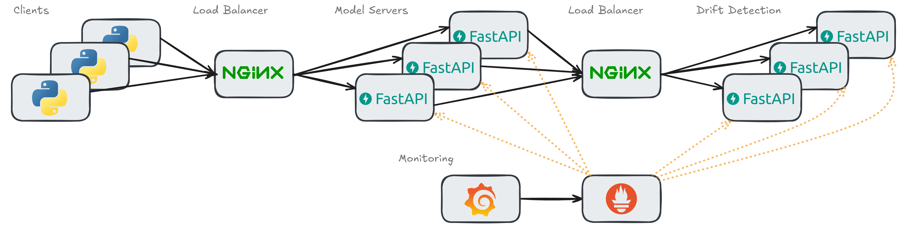

# Real-Time Data Drift Monitoring

Exploring what a real-time data drift monitoring solution could look like within MLOps.

## How It Works
1. Clients send requests to the Model Server for predictions.
2. Requests hit a load balancer (NGINX) which routes them to one of the Model Server replicas.
3. The Model Server processes the request and returns a prediction.
4. The Model Server also sends the feature data to the Metric Server for drift monitoring. This is done via a background task that runs asynchronously. This requests goes thru a load balancer and is routed to one of the Metric Server replicas.
5. The Metric Server loads a reference dataset at startup, which is used to compare incoming feature data against.
6. Incoming feature data is buffered in a rolling window.
7. Once the buffer is full:
   - A KS test is run per feature.
   - P-values and drift flags are recorded.
   - Metrics are exposed to Prometheus.
8. Grafana visualizes:
   - Number of features drifting
   - Feature-level p-values & drift flags
   - Last drift timestamp
   - Historical drift trends

Model Servers are stateless and can be scaled horizontally. Metric Servers are stateful. In this design, each metric server instance maintains its own buffer (state). That way it calculates drifts based on the data it receives.  Prometheus scrapes outputs of all metric servers and aggregates the data for a global view of drift across all features.




## Running the Project

### 1. Install Dependencies

Use [`uv`](https://github.com/astral-sh/uv) to manage the Python environment:

```bash
uv venv
source .venv/bin/activate
uv sync
```

### 2. Start All Services
Use Docker Compose to spin up  the Model Server, Metric Server, Prometheus and Grafana:

```bash
docker compose up --build
```

To scale the Model Server to handle more requests, you can use:
```bash
docker-compose up --build --scale model-server=10 --scale metric-server=10
```

This will start 10 instances of the model server and 10 instances of the metric server, allowing them to handle more concurrent requests.

Requests to the prediction API is sent to the API Gateway (NGINX), which load balances across the model server replicas.

See [nginx.conf](nginx/nginx.conf).

### 3. Run the Drift Monitor
To simulate a live data stream:
- Without Drift (Normal Scenario):
```bash
uv run run.py --drift false
```

- With Drift (Simulated Drift Scenario):
```bash
uv run run.py --drift true
```

## Dashboards

Access the grafana dashboard from : http://localhost:4000/

### No Drift Scenario


### Drift Scenario


## Load Testing With Locust

To run Load Testing with [Locust](https://docs.locust.io/en/stable/quickstart.html) follow these steps:

Run from root:

```bash
locust
```

Then open your browser and navigate to `http://localhost:8089` to access the Locust web interface. From there, you can start your load tests by specifying the target URL and the number of users to simulate.

The target URL is: `http://localhost:8002/get-prediction`


currently working on scaling up the metrics up endpoit. model endpoint is simpler because it's stateless but metric server is stateful, so I'm currently considering different ways it can be scaled.