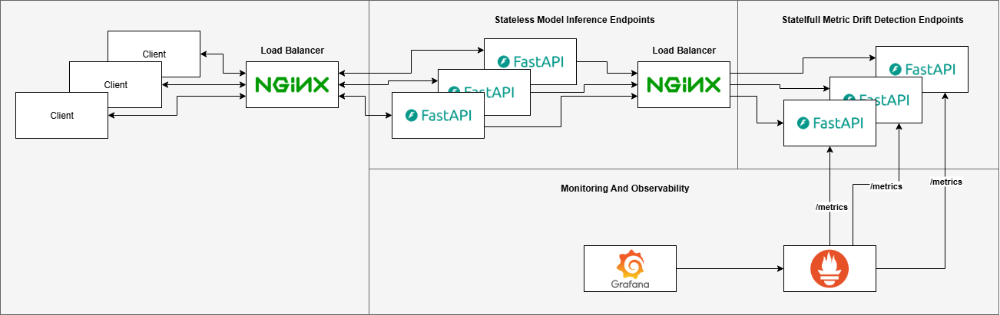
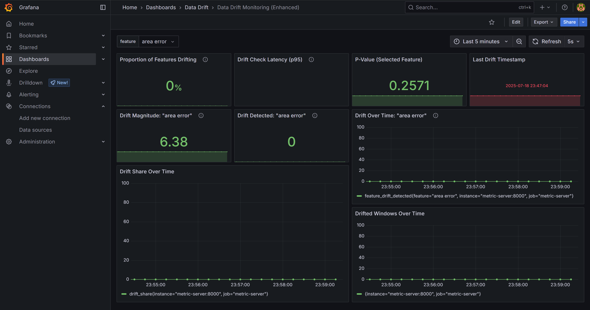
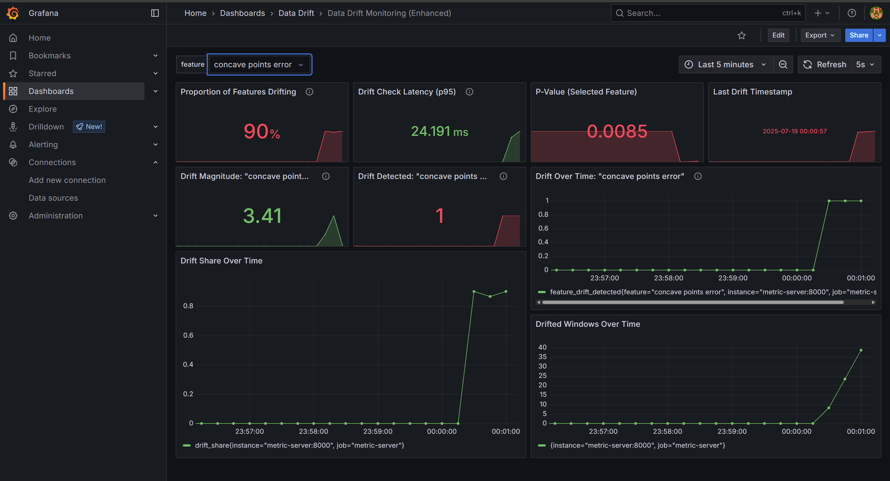

# Real-Time Data Drift Monitoring

Exploring what a real-time data drift monitoring solution could look like within MLOps.

## How It Works

1. A baseline dataset (reference) is loaded at startup.
2. Incoming feature data is buffered in a rolling window.
3. Once the buffer is full:
   - A KS test is run per feature.
   - P-values and drift flags are recorded.
   - Metrics are exposed to Prometheus.
4. Grafana visualizes:
   - Number of features drifting
   - Feature-level p-values & drift flags
   - Last drift timestamp
   - Historical drift trends




## Running the Project

### 1. Install Dependencies

Use [`uv`](https://github.com/astral-sh/uv) to manage the Python environment:

```bash
uv venv
source .venv/bin/activate
uv sync
```

### 2. Start All Services
Use Docker Compose to spin up  the Model Server, Metric Server, Prometheus and Grafana:

```bash
docker compose up --build
```

To scale the Model Server to handle more requests, you can use:
```bash
docker-compose up --build --scale model-server=10
```

This will start 10 instances of the model server, allowing it to handle more concurrent requests.

Requests to the prediction API is sent to the API Gateway (NGINX), which load balances across the model server replicas.

See [nginx.conf](nginx/nginx.conf).

### 3. Run the Drift Monitor
To simulate a live data stream:
- Without Drift (Normal Scenario):
```bash
uv run run.py --drift false
```

- With Drift (Simulated Drift Scenario):
```bash
uv run run.py --drift true
```

## Dashboards

Access the grafana dashboard from : http://localhost:4000/

### No Drift Scenario



### Drift Scenario




## Load Testing With Locust

To run Load Testing with [Locust](https://docs.locust.io/en/stable/quickstart.html) follow these steps:

Run from root:

```bash
locust
```

Then open your browser and navigate to `http://localhost:8089` to access the Locust web interface. From there, you can start your load tests by specifying the target URL and the number of users to simulate.

The target URL is: `http://localhost:8002/get-prediction`


currently working on scaling up the metrics up endpoit. model endpoint is simpler because it's stateless but metric server is stateful, so I'm currently considering different ways it can be scaled.